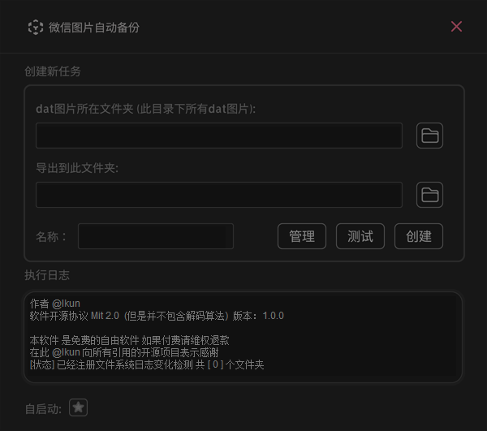
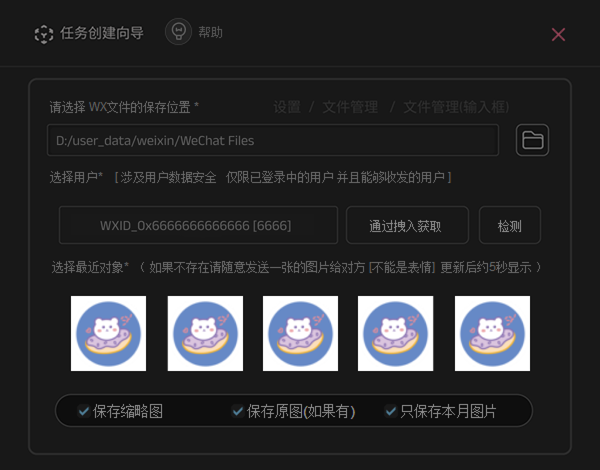

# 微信图片自动备份为普通图片

##### 由于我的一个朋友需要自动扫描老板发送的图片为文本，然后找到了dat文件浏览器，但是他不支持自动化，也不开源 运行效率也很低，所以就开发了一款用于自动备份聊天图片为普通图片的工具

------------------------------------------------------------------------------------

* 开源协议：GPL3.0  （解码算法不开源）
* 分析模式：文件读取 （不HOOK）
* 开发声明：用户能看得到的才是能读取的 看不到的不应该被获取 不越权获取
* 编程语言：Rust + C++
* 视图框架：fltk
* 内存预计：后台3M  视图模式 20M(主界面)   视图全开(极限)60M-120M(动态释放)  
* CPU用量：0%-5%(MAX)


----------------------------

### 下载链接

* 蓝奏：[下载](https://kiic.lanzouw.com/iVywr19jnfkd)

* 123： [下载](https://www.123pan.com/s/UCaqVv-9AoMA.html)

* 直链 ：[下载](https://vip.123pan.cn/1816369032/assets/WxDatViewerAutoExportRust.zip)

  
------------------------------

主界面截图
------------------------------




----------------------------------------------------------
### 二次开发


1.拉取项目代码

```shell
git clone https://github.com/kihlh/WxDatViewerAutoExportRust WxDatViewerAutoExportRust

cd WxDatViewerAutoExportRust
```


2.解决作者留下的小彩蛋

src/wh_mod/convert.rs 中的  `convert_dat_images_buff`  `convert_bat_images` 异或解码函数被破坏 因为这个不属于开源的部分

这也是更好筛选开发者的方式，**我不希望程序会被作为非法用途使用**，所以作者在工作模式做了严格限制，既然您决定二次开发此功能 您一定有相关的知识

其实解码过程非常简单 您可以从其他用户分享的代码中轻易获取到解码的算法 您可以参考  [算法参考(C#)](https://www.52pojie.cn/forum.php?mod=viewthread&tid=1507922&highlight=dat)      [算法参考(py)](https://www.52pojie.cn/forum.php?mod=viewthread&tid=1814264&highlight=dat)   [算法参考(易语言)](https://www.52pojie.cn/forum.php?mod=viewthread&tid=1457843&highlight=dat) 

君子协议：**不盈利**   **不越权**   **不破解**  **不跨设备**   **不联网**  **只允许当前用户**


3.编译

```shell
Cargo build --release
```


----------------------------
### 问与答：

**是否支持查看其他电脑的图片 或者其他人的**

- **不支持** 添加文件必须登录到用户 或者2小时前登录过


**解码是否需要登录微信 和hook api**

- **不需要** 但是设置导出需要符合上条要求 解密不依赖微信ID和UIN


**既然是开源为什么不将解码算法也开源？**

- 这是无意义的因为大部分用户都不会自行编译 而我分享的只是Rust和 fltk 的优点演示和避坑方法 以及让用户知道他的工作模式是否安全
- **有效打击不法商家移除免费声明倒卖**，开发者不排斥二次开发和生态延续，但是作者排斥无意义修改与售卖行为


**我是开发者我想二次创作**

- 您如果是开发者 决定对其进行二次创造 可以自行添加解码算法 [算法参考(C#)](https://www.52pojie.cn/forum.php?mod=viewthread&tid=1507922&highlight=dat) 如果此能力都没有那也就意味着只是为了移除启动声明中的免费软件 以便盗卖 对于程序的延续和开源生态毫无意义 ，有动手能力的人也就不需要去简单改改就做出不讲武德的事情
- **请参考 [二次开发指南](#二次开发)**


**性能占用高**

- ***这不可能***

  - Rust是内存最严格的编程语言 GC机制也是非常激进的 fltk框架是轻视图框架 如果**自启动时候没有打开窗口是只有1-3M的** 程序视图渲染是需要进行复杂逻辑运行的 如果单存纠结那几十M内存也无意义 毕竟主流的视图框架启动内存都是70以上 一百多M都常见 要么体积很大
  - 运算图片和扫描文件都是需要很费cpu的 为了追求速度 扫描拖拽用户是极限化 系统空闲资源的 但是持续时间是不长的（10万张约2秒） 【图片越少越节省】并且他是具有缓存机制的 扫描产生缓存中查找是非常迅速的 N ms级别
  - **fltk 框架是非常节省性能的视图框架**
  
  

**是否支持表情包**

- 这是个很危险的想法

- 年轻人我劝你耗子尾汁，我也很想导出我自己的表情包(收藏的)，但是我很清楚他的工作模式，所以是不能逾越的，而且这涉及人家的利益 也不属于你，小心南山必胜客请吃必胜客
- **加解密表情包是个与用户绑定的过程 是个越权行为**
